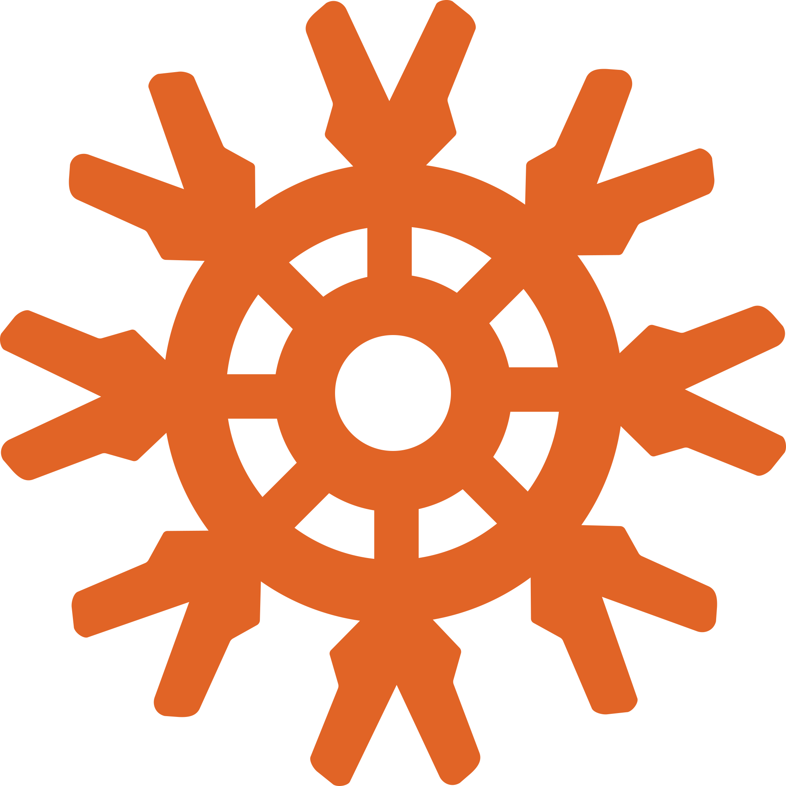
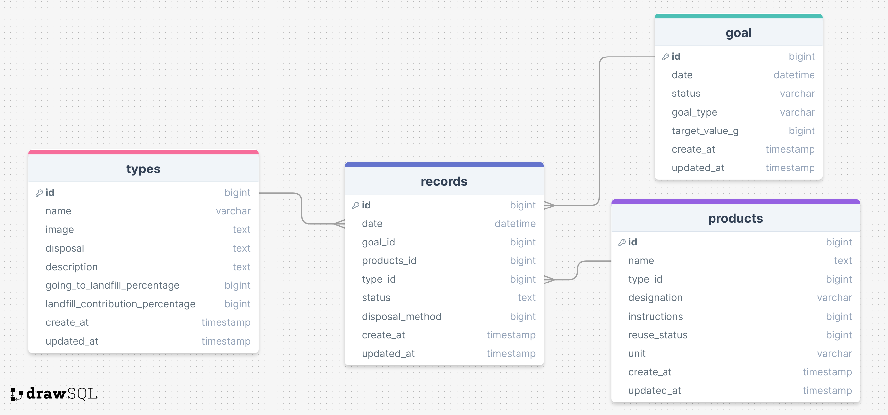

## Refine: Waste Tracking Backend

The Refine Waste Tracking Backend enable the core waste management and tracking functionality of the Refine waste tracking application. This backend of the application is dedicated to efficiently managing and tracking waste-related data, enabling users to monitor, record, and analyze their waste generation and management.

### Installation

#### Installation Steps

In the project directory,

1. Install dependencies by running:

   ### `npm install`

2. Configure environment variables:

   ### `cp .env.sample .env`

   Update the `.env` file with your database credentials and any other necessary configuration.

3. Set up mysql schema and run database migrations:

   ### `npm run migrate`

4. Run database seeding:

   ### `npm run seed`

5. Start the server:

   ### `npm start`

#### Backend Features:

1. **Types Management:**
   - Access and retrieve information about various waste types for accurate categorization within the Refine app. Additionally, it provides edcuational supports, delivering valuable waste management insights directly to users via the frontend interface.
2. **Products Management:**
   - Offers detailed insights into 51 common households waste products, including their respective waste types, disposal instructions and associated data, enhancing users' understanding of their waste streams.
3. **Goals Management:**

   - Enables users to establish and track waste management goals tailored to their specific objectives, driving sustainable waste reduction efforts and environmental impact.

4. **Records Management:**
   - Facilitates the data entry, update, and analysis of waste management records , allowing real-time monitoring of waste quantities, dates, goal progress and related metrics.

#### Technologies Used:





- **Node.js:** A powerful JavaScript runtime environment, chosen to building server-side applications and
- **Express:** A minimalist web application framework for Node.js, utilized for creating APIs and handling HTTP requests seamlessly.
- **Knex.js:** A SQL query builder for Node.js.
- **MySQL:** A popular open-source relational database management system.

#### Database



#### API Routes:

- **Types:**

  - `GET /api/wastes`: Retrieve an overview of waste types for accurate categorization.

  ```json
  {
    "id": 1,
    "name": "Plastic",
    "image": "/images/image0.jpg",
    "description": "Only 9% of all plastic waste ever produced has been recycled. Recycling plastic reduces the need for new plastic production, conserving fossil fuels and reducing greenhouse gas emissions.",
    "process": "Plastic is sorted by type and color, cleaned, shredded into flakes, melted, and then molded into new products.",
    "going_to_landfill": 79,
    "landfill_contribution": "18.50"
  }
  ```

- **Products:**
  - `GET /api/products`: Access detailed insights into waste products, including their respective types and associated data.

  ```json
   {
        "productId": 4,
        "productName": "Plastic Bottles",
        "type": "Plastic",
        "designation": "Blue bin",
        "instruction": "Rinse and flatten plastic bottles, remove caps, and place them in the blue bin. Choose reusable water bottles to reduce waste.",
        "recyclable": "high",
        "reusable": "low",
        "contribution": 200,
        "cmi": "0.50"
    }

- **Goals:**
  - `GET /api/goals`: Retrieve a list of waste management goals to drive sustainable waste reduction efforts within the Refine app.
  - `GET /api/goals/:id`: Track and monitor waste management goals to drive sustainable waste reduction efforts.
  
  ```json
   {
        "id": 1,
        "date": "2022-01-01T05:00:00.000Z",
        "goal_type": "Weekly",
        "target_value_kg": "8.50",
        "isActive": 0,
        "created_at": "2024-06-08T16:38:07.000Z",
        "updated_at": "2024-06-08T16:38:07.000Z"
    },
   ```

  - `POST /api/goals`: Establish new waste management goals to align with organizational objectives.
- **Records:**
  - `GET /api/records`: Capture, update, and analyze waste management records to monitor progress and identify trends.
  ```json
  {
        "id": 1,
        "date": "2022-01-01T05:00:00.000Z",
        "productName": "Plastic Beverage Rings",
        "type": "Plastic",
        "quantity": 2,
        "weight": 30,
        "circular_material_index": "0.05"
    }
   ```
  - `POST /api/records`: Add new waste management records to maintain an accurate representation of waste generation and management efforts.
  - `PUT /api/records`: Update existing waste management records to reflect changes and adjustments accurately.

#### Deployment:

The Waste Tracking Backend is currently deployed locally for development and testing purposes. For production deployment, consider leveraging cloud platforms such as Heroku to ensure scalability, reliability, and accessibility for users across various devices and locations.
